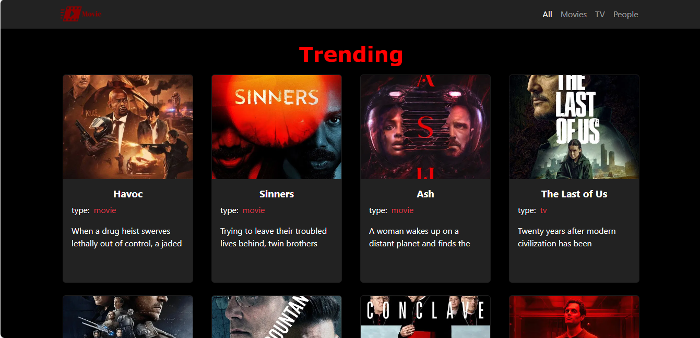
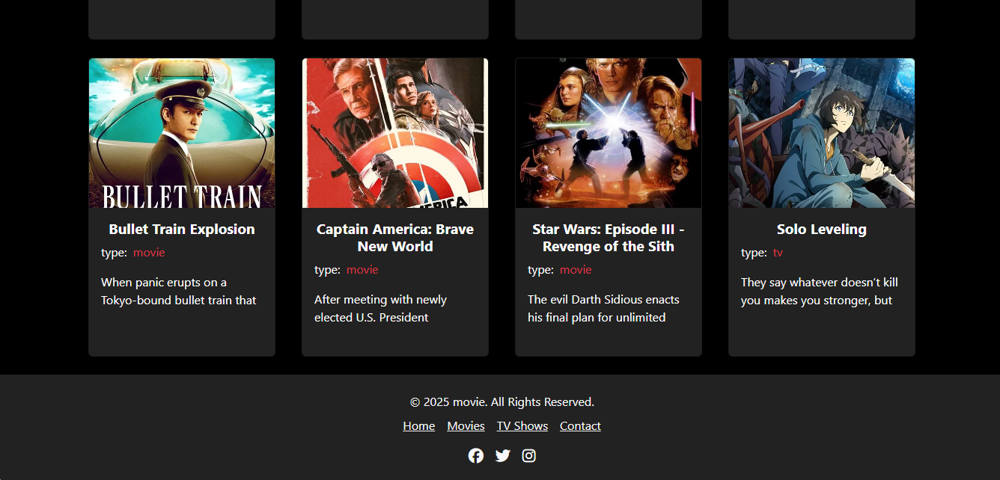
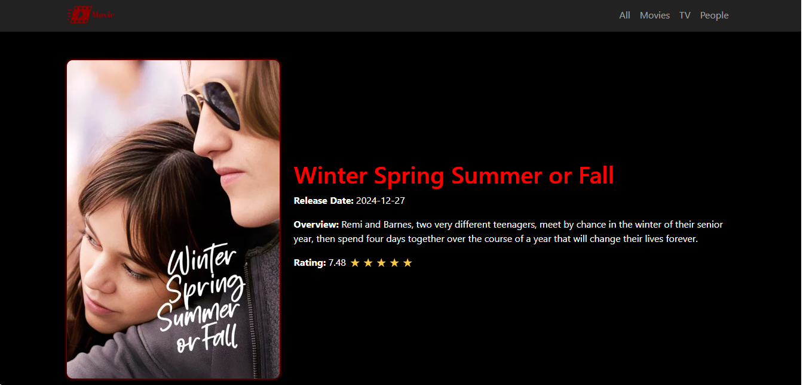

# MovieApp 🎞🎥🎬

This is a simple movie app that allows users to view trending movies, TV shows, and people, and view detailed information about them.

This project was generated using [Angular CLI](https://github.com/angular/angular-cli) version 19.2.7.

## Features

- View trending movies, TV shows, and people.
- Detailed view of each movie or TV show.
- Responsive design with Bootstrap

## Screenshots





## Technologies Used

- Angular 19
- Bootstrap 5
- TypeScript
- The Movie Database (TMDB) API

## Development server

To start a local development server, run:

```
ng serve
```

Once the server is running, open your browser and navigate to `http://localhost:4200/`. The application will automatically reload whenever you modify any of the source files.

## Code scaffolding

Angular CLI includes powerful code scaffolding tools. To generate a new component, run:

```
ng generate component component-name
```


## Installation

To get started, clone the repository and install the dependencies.

```bash
git clone https://github.com/yourusername/movie-app.git
cd movie-app
npm install